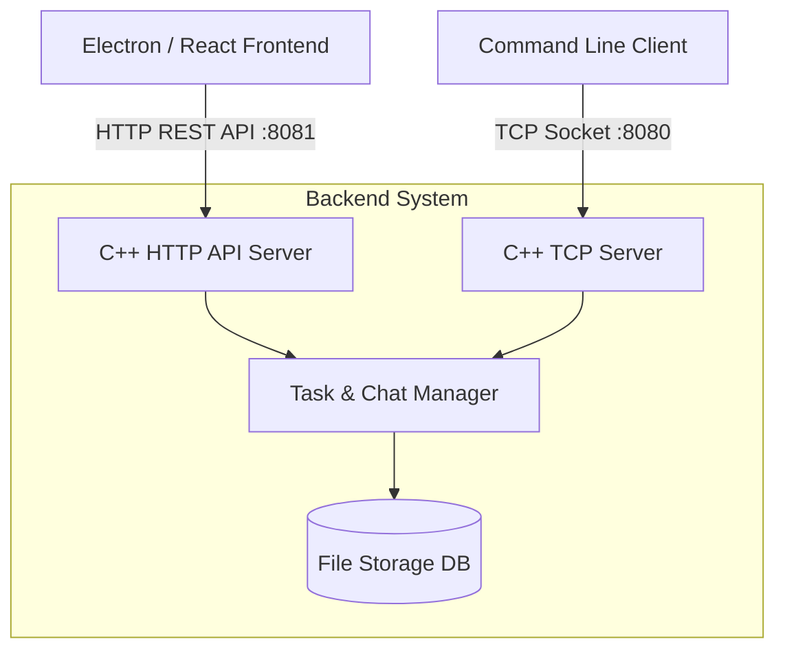

<div align="center">

# Task Manager & Real-Time Chat System

[](https://github.com/aryanghadekar)
[](https://isocpp.org/)
[](https://reactjs.org/)
[](LICENSE)
[](Makefile)

**A high-performance, cross-platform collaborative suite for agile teams.**  
Seamlessly integrates JIRA-style task management with real-time communication.

[Report Bug](https://github.com/aryanghadekar/issues) · [Request Feature](https://github.com/aryanghadekar/issues)

</div>

---

## 📖 Table of Contents
- [About the Project](#-about-the-project)
- [Key Features](#-key-features)
- [Architecture](#%EF%B8%8F-architecture)
- [Getting Started](#-getting-started)
  - [Prerequisites](#prerequisites)
  - [Installation](#installation)
- [Usage Guide](#-usage-guide)
  - [Running the Backend](#running-the-backend)
  - [Running the Frontend](#running-the-frontend)
- [API Documentation](#-api-documentation)
- [Roadmap](#-roadmap)
- [Contributing](#-contributing)
- [License](#-license)

---

## 📖 About the Project

The **Task Manager & Real-Time Chat System** is an enterprise-grade solution designed to bridge the gap between project management and team communication. Built with a robust **C++ backend** for maximum performance and a modern **React/Electron frontend** for a seamless user experience, it offers a unified workspace for developers, project managers, and QA testers.

### **Tech Stack**

| Component | Technology | Description |
|-----------|------------|-------------|
| **Backend Core** | C++11 | High-performance multi-threaded server |
| **Networking** | TCP Sockets & HTTP | Dual-protocol communication layer |
| **Frontend** | React.js + Vite | Modern, responsive user interface |
| **Desktop Wrapper** | Electron | Cross-platform desktop application |
| **Styling** | CSS3 (Variables) | Themed, maintainable styling system |
| **Build System** | CMake / Makefile | Automated build processes |

---

## ✨ Key Features

- **🛡️ Role-Based Access Control (RBAC)**: secure environments for Admins, Project Managers, Developers, and Testers.
- **⚡ Real-Time Synchronization**: Instant updates for task status changes and chat messages.
- **📊 Interactive Dashboard**: Visual overview of project health, including overdue tasks and workload distribution.
- **💬 Integrated Chat**:
    - **Public Channels**: Team-wide announcements and discussions.
    - **Private Messaging**: Secure direct messages between team members.
    - **Privacy First**: Private messages are never logged to server files.
- **🧠 Smart Assignment**: Intelligent algorithms to recommend task assignees based on current workload.
- **📅 Deadline Tracking**: Built-in deadline management with visual overdue alerts.

---

## 🏗️ Architecture

The system utilizes a dual-server architecture to support both legacy CLI clients and modern web/desktop frontends simultaneously.



---

## 🚀 Getting Started

### Prerequisites

Ensure you have the following installed on your development machine:

*   **C++ Compiler**: GCC (Linux/macOS) or MinGW/MSVC (Windows).
*   **CMake**: Version 3.15 or higher.
*   **Node.js**: v18.0.0 or higher.
*   **npm**: Included with Node.js.

### Installation

1.  **Clone the Repository**
    ```bash
    git clone https://github.com/yourusername/Task-Manager-and-Real-Time-Chat-System.git
    cd Task-Manager-and-Real-Time-Chat-System
    ```

2.  **Install Frontend Dependencies**
    ```bash
    cd frontend
    npm install
    cd ..
    ```

3.  **Build the Backend**
    *   **Using Makefile (macOS/Linux)**:
        ```bash
        make clean && make all
        ```
    *   **Using CMake (Cross-Platform)**:
        ```bash
        mkdir build && cd build
        cmake ..
        make
        ```

---

## 🏃 Usage Guide

### Running the Backend

The backend must be running for the application to function. It launches both the HTTP API server (port 8081) and the TCP socket server (port 8080).

```bash
# From project root
./server_api
```

*You should see output indicating both servers are listening.*

### Running the Frontend

Open a new terminal window to run the frontend client.

**Option A: Web Development Mode**
```bash
cd frontend
npm run dev
# Access at http://localhost:5173
```

**Option B: Electron Desktop App**
```bash
cd frontend
npm run electron:dev
```

---

## 🔌 API Documentation

The backend exposes a RESTful API on port `8081`. All endpoints typically require authorization via a specific token provided upon login.

| Method | Endpoint | Description |
|--------|----------|-------------|
| `POST` | `/api/login` | Authenticate and retrieve session token |
| `GET`  | `/api/tasks` | Retrieve all project tasks |
| `POST` | `/api/tasks` | Create a new task (Admin/PM only) |
| `GET`  | `/api/chat` | Fetch recent chat history |
| `POST` | `/api/chat` | Send a message to the public channel |
| `GET`  | `/api/dashboard` | Get aggregated project statistics |

---

## 👥 Demo Accounts

Use these pre-configured accounts to explore different roles:

| Role | Username | Password | Permissions |
|------|----------|----------|-------------|
| **Admin** | `admin` | `admin` | Full System Access |
| **Manager** | `pm1` | `pm1` | Create & Assign Tasks |
| **Developer** | `dev1` | `dev1` | Update Status, Chat |
| **Tester** | `tester1` | `tester1` | Verify Tasks, Chat |

---

## 🤝 Contributing

Contributions are what make the open-source community such an amazing place to learn, inspire, and create. Any contributions you make are **greatly appreciated**.

1.  vFork the Project
2.  Create your Feature Branch (`git checkout -b feature/AmazingFeature`)
3.  Commit your Changes (`git commit -m 'Add some AmazingFeature'`)
4.  Push to the Branch (`git push origin feature/AmazingFeature`)
5.  Open a Pull Request

---

## 📜 License

Distributed under the **ISC License**. See `LICENSE` for more information.

---

<div align="center">
  <sub>Built with ❤️ by the Engineering Team.</sub>
</div>
